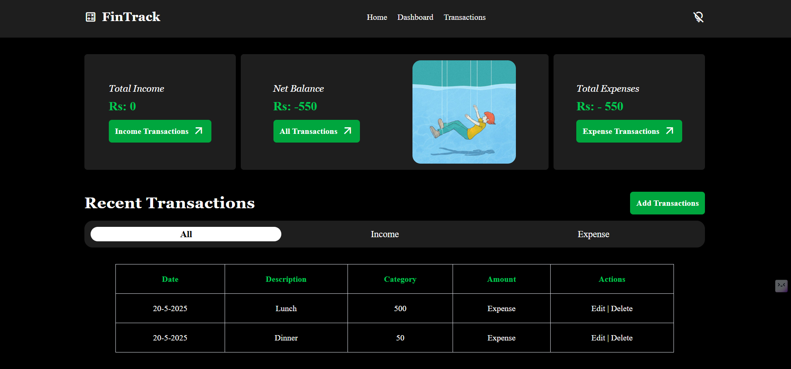
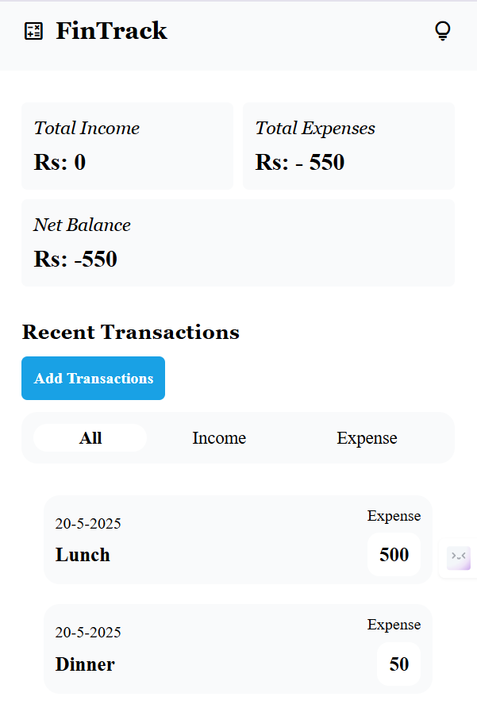

# 💰 Expense Tracking - Income Expense Calculator

A modern, responsive, and user-friendly **Income Expense Calculator** web application built using **HTML**, **Tailwind CSS**, and **JavaScript**. This application helps users **track, manage, and visualize** their income and expenses seamlessly with full **CRUD** functionality and persistent **localStorage** support.

## 🔗 Live Demo

[View Live Demo](https://fintrackwebapp.netlify.app/) 

---

## 📸 Preview



---
## 📸Mobile Preview

 

---

## 🌟 Features

- 🧮 **Track Total Income, Expenses, and Net Balance**
- 🧊 **Add, Edit, Delete Entries**
- 📦 **Persistent Data using LocalStorage**
- 🔄 **Real-time updates with smooth transitions**
- 📱 **Fully Responsive Design (Mobile-first)**
- 🎨 **Visually appealing dashboard layout**
- 🧠 **Filter by All, Income, or Expense entries**

---

## 🧩 UI Layout Overview

### 🔝 Header
- Implemented Light and dark mode
- App title navbar

### 📊 Summary Section
- Total **Income** (Green Card)
- Total **Expenses** (Red Card)
- **Net Balance** (Neutral/Blue Card)
- Cards update dynamically with animation

### 📝 Input Section
- Soft, card-style input container
- **Fields:**
  - Description (Text)
  - Amount (Number)
  - Category (Radio: Income / Expense)
- **Buttons:**
  - **Add Transactions** 
  - **Reset**

### 📋 Entry List
- Scrollable list with transaction cards
- Includes:
  - Description
  - Amount
  - Action buttons: ✏️ Edit and 🗑️ Delete

### 🎯 Filter Options
- 3 Pill-style toggles: **All**, **Income**, **Expense**
- Visual highlight for active filter

---

## 💾 Tech Stack

- **HTML**
- **Tailwind CSS** (for styling)
- **JavaScript** (vanilla, for logic)
- **LocalStorage** (for data persistence)
- **MockApi** (for data persistence)

---

## 📱 Responsive Design

- Built with **mobile-first** principles
- Uses **Flexbox** and **Grid**
- Scales smoothly from small to large screens

---

## 🎨 Visual Design

- **Font:** Poppins / Inter / Rubik (clean, modern, readable)
- **Style:**
  - Dashboard-like layout
  - Shadows, spacing, smooth transitions
  - Intuitive and calm user experience
  - Optional video/testimonial placeholder

---

## 🚀 How to Use

1. **Clone the Repo**
   ```bash
   git clone git@github.com:CodeRamana/expense-tracker.git
   cd expense-tracker

---
### 🙌 Credits

Developed with ❤️ by [Ramana S](https://github.com/CodeRamana)